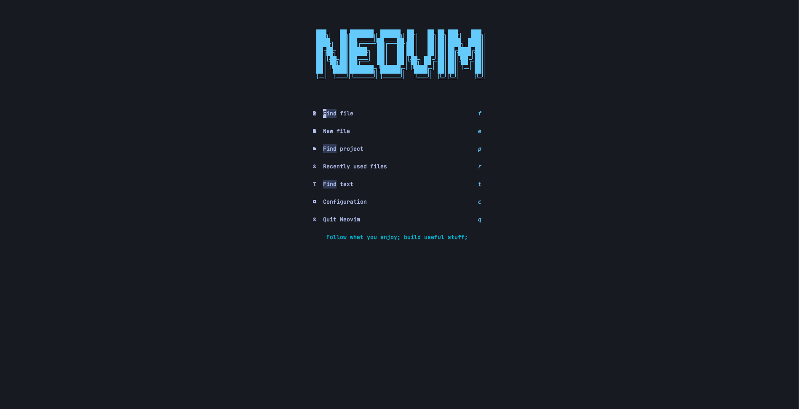
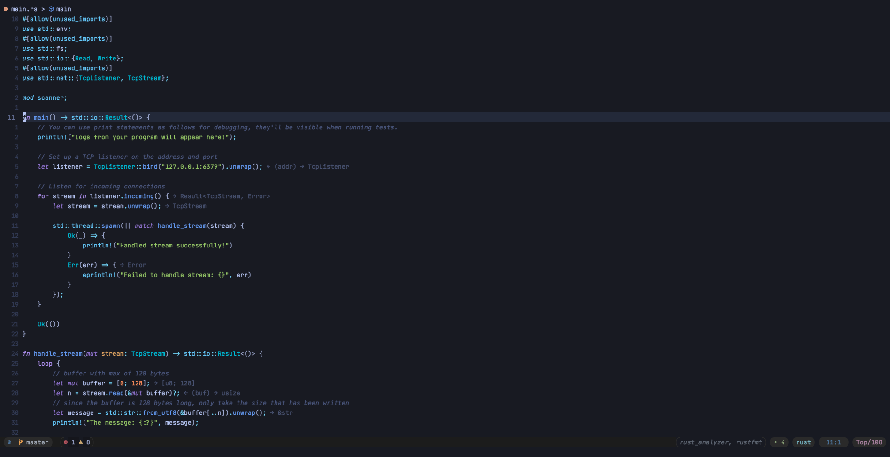

# NeoVim
Most of the development that I do is in Rust and Elm. I working out kinks in the rust debugging, be aware that you might run into trouble. It should work in most cases.


## Based on Neovim From Scratch
[Chris@Machine](https://github.com/ChristianChiarulli) does a lot of great work in the neovim space. This config is based on his [Neovim from scratch](https://github.com/LunarVim/Neovim-from-scratch) series. If you are looking for an out of the box developer experience I would recommend checking out [LunarVim](https://github.com/LunarVim/LunarVim). You can also check out projects like [NvChad](https://github.com/NvChad/NvChad) or Neovide(https://github.com/neovide/neovide). If you are feeling a bit adventerous, check out [Helix](https://github.com/helix-editor/helix)!


## Requirements
- This config is dependent on Neovim 0.8. You can install it yourself or if you are on a MacOS computer you can use the install script in the repo. Pass in a `-s` flag to install the latest stable release of neovim. As of writing this readme that is 0.8

If you are running this config for the first time run `:PackerSync` to download and install plugins

## ScreenShots





## Get healthy

Open `nvim` and enter the following:

```
:checkhealth
```

